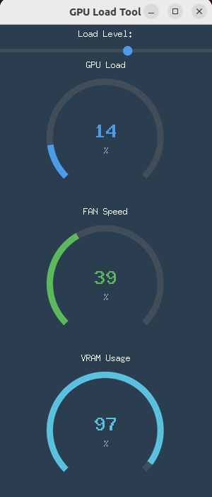

# GPUheater
- Making warm in the cold office by GPU power

## added power stress type ver.

**calcgppower.py**

```
pip install ttkbootstrap


```
- A simple, lightweight Python utility designed to apply a configurable load to NVIDIA GPUs. It allows users to test thermal performance, fan curves, and system stability under stress, providing a real-time GUI to monitor GPU utilization, VRAM usage, and fan speed.

## Screenshot


*(Replace `sample-image.png` with a screenshot of the application running.)*

## Features

-   **Interactive GUI:** A clean and modern interface built with `ttkbootstrap`.
-   **Adjustable GPU Load:** A simple slider (0-100%) to control the intensity of the computational load on the GPU.
-   **Proportional VRAM Usage:** VRAM consumption is directly linked to the load slider, allowing for predictable memory stress.
-   **Real-time Monitoring:** Live gauges display GPU Utilization (%), Fan Speed (%), and VRAM Usage (%).
-   **Efficient Stressing:** Utilizes PyTorch for highly efficient CUDA computations to generate a consistent and powerful load.
-   **Safe and Controlled:** The load stops and VRAM is cleared immediately when the slider is set to 0 or the application is closed.

## Motivation

This tool was created for users who want to safely induce high temperatures and fan activity on their NVIDIA graphics cards. It's particularly useful for:

-   Testing the effectiveness of a new thermal paste application or heatsink.
-   Verifying the stability of an overclock or undervolt.
-   Configuring and testing custom fan curves using software like MSI Afterburner.
-   Simply checking if the cooling system of a graphics card is performing as expected under sustained load.

## Requirements

-   Python 3.8+
-   An NVIDIA GPU with CUDA support.
-   NVIDIA drivers appropriate for your GPU.

## Installation

1.  **Clone the repository:**
    ```bash
    git clone https://github.com/your-username/your-repo-name.git
    cd your-repo-name
    ```

2.  **Create a `requirements.txt` file** with the following content:
    ```
    ttkbootstrap
    pynvml
    ```

3.  **Install the basic requirements:**
    ```bash
    pip install -r requirements.txt
    ```

4.  **Install PyTorch with CUDA support:**
    The version of PyTorch must match your system's CUDA driver version for best results. Check your CUDA version by running `nvidia-smi`. Then, visit the [PyTorch official website](https://pytorch.org/get-started/locally/) to find the correct installation command.

    For example, for a system with CUDA 12.1 or newer, the command is:
    ```bash
    pip install torch torchvision torchaudio --index-url https://download.pytorch.org/whl/cu121
    ```

## Usage

Simply run the main Python script:

```bash
python your-script-name.py
```
*(Replace `your-script-name.py` with the actual name of the file, e.g., `fengpower.py`)*

-   Move the slider to the right to increase the load on the GPU and VRAM.
-   Move the slider to 0 to stop the load.
-   Close the window to terminate the application safely.

## How It Works

-   **GUI:** The user interface is built with Python's standard `tkinter` library, styled with the modern `ttkbootstrap` theme pack.
-   **GPU Load Generation:** A dedicated thread runs a continuous `while` loop. In this loop, large matrix multiplications (`torch.matmul`) are performed on the GPU. The average load is controlled by adjusting the size of these matrices and inserting a small, calculated `time.sleep()` period, which is inversely proportional to the desired load from the slider.
-   **VRAM Stress:** The tool maintains a list that holds large, persistent PyTorch tensors on the GPU. The number of tensors in this list is directly controlled by the slider's position, allowing for predictable and sustained VRAM allocation.
-   **Monitoring:** A separate monitoring thread uses the `pynvml` library (Python bindings for the NVIDIA Management Library) to poll the GPU for statistics (utilization, memory, fan speed) every second and updates the GUI gauges accordingly.

## ⚠️ Disclaimer

**Use this tool at your own risk.**

Stressing your hardware components for extended periods can lead to high temperatures and increased power consumption. While this tool is designed to be safe, the author is not responsible for any damage to your hardware that may result from its use. Always ensure your system has adequate cooling before running any stress-testing software.

## License

This project is licensed under the Apache-2.0 License. See the `LICENSE` file for details.
